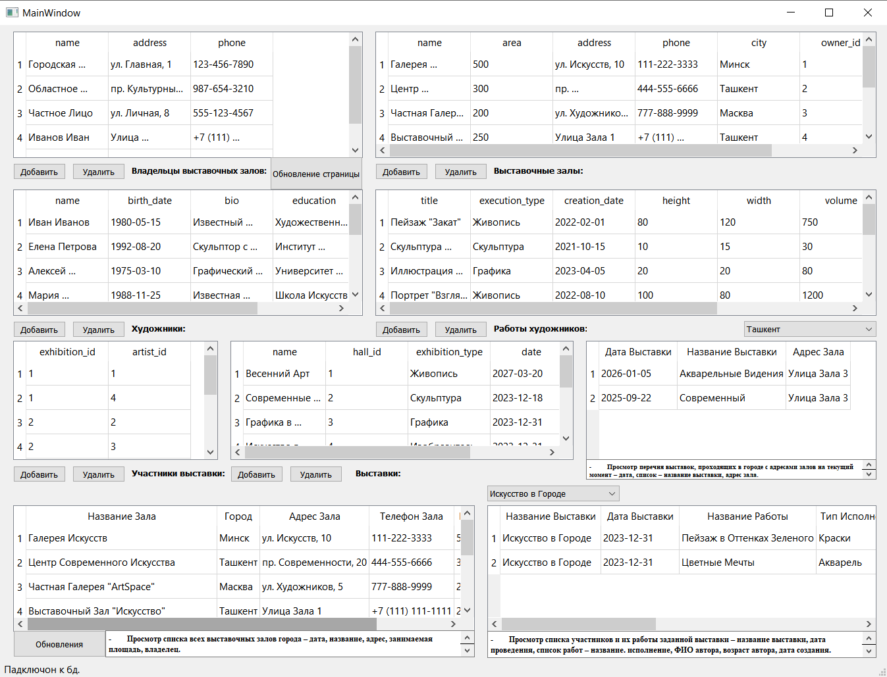

# ExhibitionDB App

Приложение на **C++ и Qt**, работающее с базой данных SQLite.  
Используется для просмотра и управления данными выставки (Exhibition DB).

## 🖼️ Интерфейс приложения

## 📂 Структура проекта
Exhibitiondb_app/
│ main.cpp # Точка входа в приложение
│ mainwindow.cpp # Логика главного окна
│ mainwindow.h # Заголовочный файл главного окна
│ mainwindow.ui # Qt Designer UI форма
│ togo.pro # QMake проектный файл
│
└─── database/
└── lab2(ПБЗ).db # SQLite база данных

## ⚙️ Технологии
- C++ 17
- Qt 5 (Widgets, QtSql)
- SQLite

## 🚀 Как запустить
1. Установите **Qt** (рекомендуется Qt 5.12 или выше).  
2. Откройте проектный файл:

через Qt Creator или в VS Code (с Qt расширением).  
3. Соберите и запустите проект.  
4. Приложение автоматически подключается к базе данных `database/lab2(ПБЗ).db`.

## 📌 Возможности
- Подключение к SQLite базе данных.  
- Просмотр и работа с таблицами.  
- Графический интерфейс (Qt Widgets).  

## 👤 Автор
Разработчик: Jasur  
